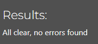

# Type-Golf

Type-Golf is an python terminal game that allows user to play 9 holes of golf using just their keyboard. The terminal will tell the player what clubs are in their bag, then the par and distance for the hole then allow the user to select a club from the bag to suit.

## User Experience (UX)

Type-Golf provides a fun and replayable experience that allows users to play 9 randomly generated holes. With its replayability this game is sure to keep users engaged and coming back.

### User Stories

* First-time visitor goals
    * Understand the main function of the game.
    * Playing 9 Holes.
    * Checking their score at the end of the game.
    * Enjoying the overall experience.

* Returning visitor goals
    * Play against friends.
    * Explore new features.
    * Continuing to enjoy the overall experience.

* Frequent user goals
    * Aim to master the game by learning distances and finish under par.
    * Compete with other users in their local enviroment.
    * Exploring new features.
    * Continuing to enjoy the overall experience.

---

## Features

* Main objective is to provide an enjoyable and interactive golf experience for users to relax and enjoy. 

* The terminal tracks the users score and number of strokes.

 

* Variety of clubs for the player to use.

* Each club has their own distances which are random within a range.

* When the user hits the ball onto the green (within 20yards) the game automatically putts the ball.

* The user will have their score displayed at the end when 9 holes have been played.

## Features Left to Implement

* Add more clubs.
* Make the game local multiplayer and add a username system.
* Add a probability which can affect the ball such as wind and weather effects.

---

## Design

Flow Chart
  
I used drawio to design a flowchart to understand the concept for the game.
  

  
  

---

## Technologies Used

* [Python3](https://en.wikipedia.org/wiki/Python_(programming_language))
---

## Frameworks, Libraries & Programs Used

* [Gitpod](https://www.gitpod.io/)
    * To write the code.
* [Git](https://git-scm.com/)
    * for vesion control.
* [Github](https://github.com/)
    * Storing the files online.
* [Heroku](https://www.heroku.com/auth/login)
    * Deploying the code.

---

## Testing

The W3C Markup Validator, W3C CSS Validator and JSHint were used to validate every html, css, and js file to ensure there were no errors.

* [Code Institute Python linter](https://pep8ci.herokuapp.com/)

### Validation results

## Manual Testing 

* The website was tested by the developer and multiple volunteers.

| Feature | Expected Result | Steps Taken | Actual Result |
| ------- | ----------------|-------------|---------------|
| Rules   | To display the rules when "y" is entered into the terminal or error message "Invalid input please type y/n" when incorrect value is entered | Input "y" into terminal, input "n" to skip and input nothing to check error message works| As Expected |
| Selecting a Club | Hit shot with selected club then provide feedback to the user | Input club name "driver" for example into terminal. | As Expected |
| Selecting a Club that doesn't exist | Error message to appear "You do not have this club in your bag or club name invalid | Tried to input a club that's not in the bag | As Expected | 
| Putting | Putting to happen automatically when a shot makes it to the green | Hit shot onto the green using an iron | As Expected |
| Game end | Terminal to provide achieved strokes and score then provide exit prompt | Finish 9 holes then input exit when prompted | As Expected |

## Input validation testing

* Display Rules
    * Must be "y" or "n"
    * Can't continue unless value is input
* Club Selection
    * Input must contain valid club name from the bag or abbreviation. For example "5i" for 5 Iron
    * Cannot continue unless club is selected
* Exit
    * Input must be "exit" or game will not end

## Fixed Bugs
* if the ball landed exactly 20 yards from the hole it wasn't possible to hit the ball onto the green without first hitting it away with a bigger club, tweaked the range of the lob wedge to counteract this.
* 9 Iron could not be used due to a mistake when defining the function.
* If the user got a hole in one or hit the ball into the hole from the fairway the game would end abruptly due to an error in indentation.
## Deployment

### Deploying to Heroku

To deploy with Heroku, Code Institute Python Essentials Template was used so the python code can be viewed in a terminal in a browser
1. Log in to Heroku or create a new account
2. On the main page click "New" and select "Create new app"
3. Choose your unique app name and select your region
4. Click "Create app"
5. On the next page find "settings"
6. Scroll down, locate "Buildpack" and click "Add", select "Python"
7. Repeat step 6. only this time add "Node.js", make sure "Python" is first
8. Scroll to the top and select "Deploy" tab
9. Select GitHub as deployment method and search for your repository and link them together
10. Scroll down and select either "Enable Automatic Deploys" or "Manual Deploy"
11. Deployed site [Type Golf](https://type-golf-99d1ba37f1f5.herokuapp.com/)

### Forking the GitHub Repository

By forking the repository, we make a copy of the original repository on our GitHub account to view and change without affecting the original repository by using these steps:

1. Log in to GitHub and locate [GitHub Repository type-golf](https://github.com/LewisClements21/type-golf.git)
2. At the top of the Repository(under the main navigation) locate "Fork" button.
3. Now you should have a copy of the original repository in your GitHub account.

### Local Clone

1. Log in to GitHub and locate [GitHub Repository type-golf](https://github.com/LewisClements21/type-golf.git)
2. Under the repository name click "Clone or download"
3. Click on the code button, select clone with HTTPS, SSH or GitHub CLI and copy the link shown.
4. Open Git Bash
5. Change the current working directory to the location where you want the cloned directory to be made.
6. Type `git clone` and then paste The URL copied in the step 3.
7. Press Enter and your local clone will be created.

## Credits

### Code

 * I gained most of my understanding of python from Code Institute lessons.
 * I used w3schools to understand the range() function https://www.w3schools.com/python/ref_func_range.asp
 * I used docs.python.org to better understand how to use the random () function https://docs.python.org/3/library/random.html

  ### Content

  * All content was written by the developer.
---

## Acknowledgements

 * My mentor Mitko Bachvarov provided very useful feedback.
 * Slack community for inspiration.